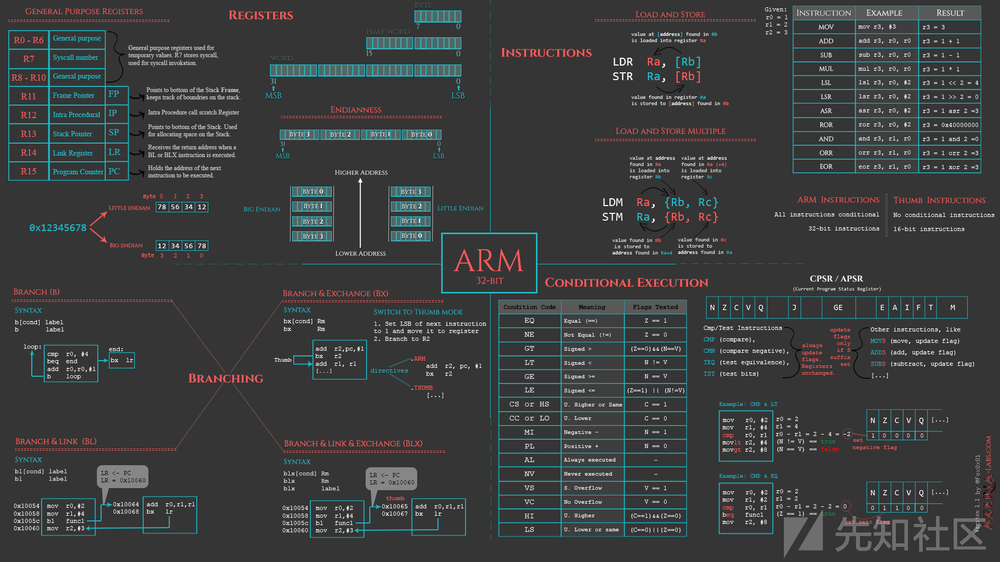

> w0lfzhang@HAT

### ARM简介
ARM, Advanced RISC Machine, 是一个32位RISC处理器架构。ARM处理器广泛应用于嵌入式系统和物联网设备中，例如路由器，交换机，智能手机等。

ARM处理器支持7中运行模式，每种模式有自己的堆栈空间以及一组不同的寄存器子集。

1. 用户模式（user）：正常程序执行模式；
2. 快速中断模式（FIQ）：高优先级的中断产生会进入该种模式，用于高速通道传输；
3. 外部中断模式（IRQ）：低优先级中断产生会进入该模式，用于普通的中断处理；
4. 特权模式（Supervisor）：复位和软中断指令会进入该模式；
5. 数据访问中止模式（Abort）：当存储异常时会进入该模式；
6. 未定义指令中止模式（Undefined）：执行未定义指令会进入该模式；
7. 系统模式（System）：用于运行特权级操作系统任务；

不过在Cortex系列中稍有不用，Cortex-A 和 Cortex-R 处理器有以上7中模式，而Cortex-M则只有两种模式，Thread 模式和 Handler 模式，Thread 模式没有特权，用于应用程序代码， Handler 模式有特权，用于异常处理程序（以下情况不适用于Cortex-M处理器）。

### 寄存器介绍
ARM处理器有40个寄存器，32个通用寄存器，7个状态寄存器，一个PC寄存器，每一个模式对应有一种寄存器。

几个常用的寄存器：
1. R0-R3用户函数调用参数传递
2. R13，堆栈指针寄存器，也称为SP
3. R14，又称为LR，链接寄存器，用于保存函数调用时的返回地址
4. R15，又称为PC，程序计数器。在ARM状态下，位[1:0]为0，位[31:2]用于保存PC；在Thumb状态下,位[0]为0，位[31:1]用于保存PC。对于ARM指令集而言，PC总是指向当前指令的下两条指令的地址，即PC的值为当前指令的地址值加8个字节。

### 寻址特点

1 . pc 寻址

如果汇编代码中使用 pc 间接寻址的话，实际得到的是 pc+偏移量+8 的地址中的内容，如：

```
# pc = 0x1000
ldr  r0, [ pc, #12 ]
```

那么 r0 寄存器的结果是：`r0 = [0x1000+12+8] = [0x101a]`

## 知识点图

