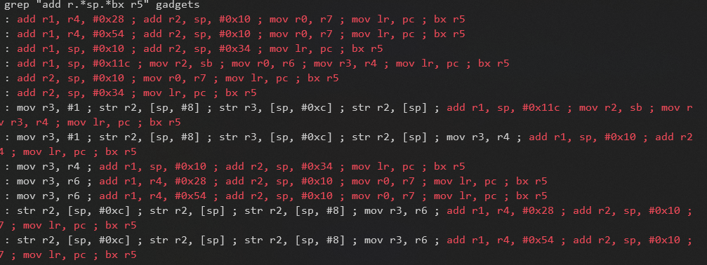
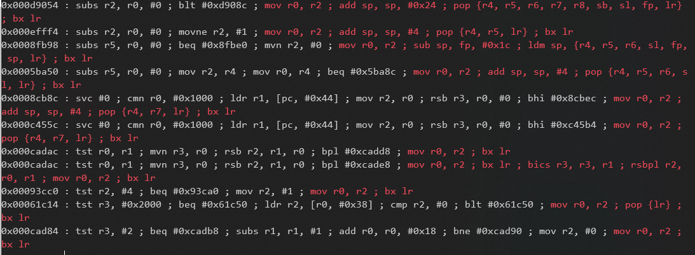

> w0lfzhang@HAT

[TOC]

### 概述
ARM架构下的栈溢出利用跟x86，mips等架构下的利用过程差不多，只需要找到合适的gadgets即可，而我们照样可以用ROPGadget来寻找我们的gadgets。接下来记录下怎么一步一步来寻找我们的gadgets。

### ARM指令概述
arm指令和x86有点相似之处，相比mips指令读起来更加容易理解。
ROP经常用到的指令如下:


arm架构下的函数返回时用LDMFD指令加BX指令，首先用LDMFD指令pop保存的寄存器的值以及LR的值，然后跳转至LR。在ROP的时候很多情况下可以利用LDMFD指令来减少ROP时用到的gadgets。

### 一步一步寻找gadgets
我们ROP的最终目的是执行system(cmd)，cmd一般来说放到栈上，虽然针对未开地址随机化的情况，可以考虑放堆上，但还是会不稳定。所以绝大多数情况需要放到栈上面，这就需要找一个gadget来设置r0为一个栈地址，然后再寻找一个gadget跳到system即可。

ARM架构下的ROP有一个好处就是在函数返回时大多数情况会pop还原一些保存的寄存器的值，例如R4-R5，R4-R7等，这种情况可以利用函数本身的gadget来减少ROP的复杂程度。而如果函数返回时没有pop出lr以外的寄存器的话，这种情况就需要另外调整寻找gadgets的思路了。

#### 第一种情况 
首先利用ROPGadget将libc中可利用的gadget找出来：
```
ROPgadget --binary libc.so > gadgets
```
加入发生溢出的函数在返回时有以下指令操作：
```
LDMFD  SP!, {R4-R11,LR}
BX  LR
```
这里我们可以控制R4-R11和LR寄存器。
首先寻找类似`bx r5`的gadget，同时gadget也需要满足将栈地址赋值给一个通用寄存器。
```
grep "add r.*sp.*bx r5" gadgets
```


我们就随便选取第六个gadget即可。
```
gadget1:
    add r2, sp, #0x34
    mov lr, pc
    bx r5
```
然后我们需要寻找一个类似`mov r0, r2`的gadget，但同时该gadget需要能控制程序流。
我们可以用如下命令寻找：

```
grep "mov r0, r2.*bx lr" gadgets
```



我们可以选取如下gadget：
```
gadget2:
    mov r0, r2
    pop {lr}
    bx lr
```

然后这两个gadgets结合程序本身的LDMFD指令即可完成ROP。
这个时候payload为：
```
                    r5            ret_addr
					||			   ||
payload = fill + gadget2 + fill + gadget1 + fill +  system + fill + cmd
```

#### 第二种情况
当函数返回时仅仅只有pop lr等操作时，这种情况下的ROP更加通用，跟MIPS架构下的ROP思路差不多。
这时我们只需要在上面的情况下找一个gadget来设置r5即可。满足条件的有很多，基很多函数返回时的最后两台指令都可以。
```
gadget3:
    LDMFD  SP!, {R4-R6,LR}
    BX   LR
```
这个时候只需要在上述payload前面加上该gadget即可。
```
                 ret_addr
                   ||
payload = fill + gadget3 + fill + gadget2 + fill + gadget1 + fill +  system + fill + cmd
```

