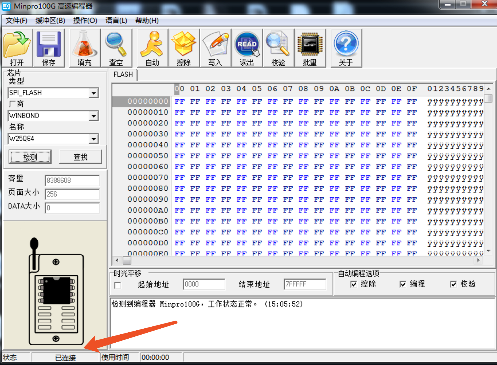
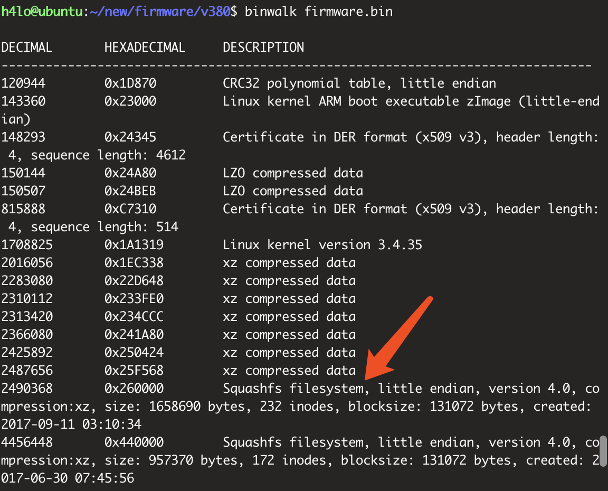

> H4lo@HatLab

[TOC]

## 实验环境

### 硬件环境

1. 笔记本电脑
2. 螺丝刀、镊子
3. 热风枪、电烙铁
4. Min pro 100 flash 编程器
5. 芯片夹

### 软件环境

1. Min pro 100 专用编程器软件（见附件）
2. binwalk

## 设备信息

- 设备名称：VR CAM（灯泡摄像头）
- 设备型号：VR-V380-V9-A
- 设备版本号：2018040121147

## V380 摄像头固件提取步骤

1 . 拆开设备的外壳，观察板子正面的一些组件

在上面是主控芯片，左边是一个 flash rom。

再来看板子的背面，在右上面是一个 wifi 芯片，用于连接 wifi 和建立热点：

中间是一个摄像头模组，底下是一个 sd 卡的插槽。别的就是一些例如麦克风、红外的接口。

2 . 找到 flash rom 的位置

在上图的板子的左边可以很清楚的看到 8 脚的 NAND flash，且发现芯片厂商是 Windbond，型号是 `W25Q64JVS10`。

3 . 使用热风枪对准 flash，对其进行加热并慢慢吹下：

在此过程中可以加点助焊剂，用镊子轻挑：

吹下之后是这样的：

- 有点丑，orz。。注意在加热 flash 时，千万不要不小心破坏周围的元件，否则将 flash 重新焊上的时候，很可能导致设备出问题。

4 . 将芯片夹夹在 flash 上，连接编程器，夹的位置一定要对上。尤其是接地的脚（红色的线）要对应上。

- 这里笔者使用的是 MinPro 100G 编程器，当然用其他型号也是可以的。

5 . 将编程器连接电脑，使用 MinPro 100G 编程器软件进行读取：

使用软件之前需要先安装驱动，进入软件会提示 "已连接"。

点击左边的检测按钮，如果不出意外的话就会识别出相应的芯片的型号。

接着点击上方的读出按钮，软件就会进行读取 flash 的内容。读取完成之后就会显示出缓冲区的内容：

- 接着最好使用校验的功能，来检测读出来的内容是否有误。一般是不会有问题的。

对于读取出来的内容，我们接着点击上方的保存按钮，保存在本地即可。

6 . 尝试使用 binwalk 分析固件，这里看到 binwalk 已经成功分析出了文件系统，所以我们这边读取固件就成功了。

### 回焊 flash

固件读取完成之后，就可以将 flash 重新使用电烙铁重新焊回。焊回之后是这样的：

连接电源测试，发现可以正常启动：

那么接着就可以进行常规的二进制漏洞挖掘，对摄像头的各个功能点进行测试了。