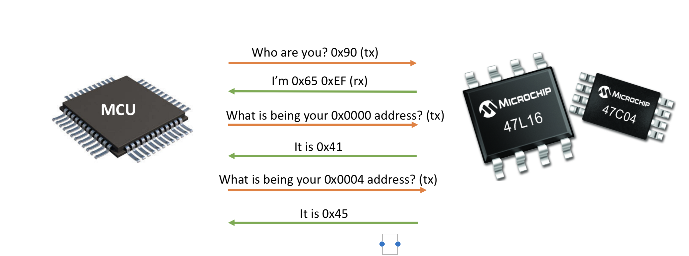

## 需要的工具

1. 电烙铁
2. 热风枪
3. 编程器（芯片烧写器）
4. 芯片夹


## 固件提取通用步骤

1. 对某款路由器进行外壳的拆解，先下完所有螺丝，使用撬棒撬开卡扣。
2. 分析板子的各个组件
3. 找到 flash rom 的位置（8 pin 或者 16 pin）
4. 使用芯片夹和编程器进行固件的提取


### 存储器芯片型号代表的含义

在 PCB 板上有芯片的厂商名和具体的型号，我们需要对这些型号的字段含义要有一定的了解。以芯片 `W25Q64JVS10` 进行举例：

```
W						// 表示厂商的缩写，W 即为 Windbond（华邦）
25Q					   // 表示产品类型，即为
64						// 表示存储容量。该存储芯片的容量为 64 Mbit，转换过来就是 8 MB。
JV						// 表示内存芯片的修正版本，JV 为新版芯片
S10				
```

- 参考资料：https://blog.csdn.net/txwtech/article/details/82826792

### 提取原理


当编程器通过芯片夹对准 flash 时，上电之后相当于其充当 mcu，与 flash 进行通信，进而将 flash 中的数据进行读出。




## 案例一/某路由器读取固件


具体操作步骤见子目录下案例。


## 案例一/某摄像头读取固件

具体操作步骤见子目录下案例。


## 参考资料

[如何自建IoT实验室](https://mp.weixin.qq.com/s/ekx8U3PAV0eh2loIYbxrnw "如何自建IoT实验室")
