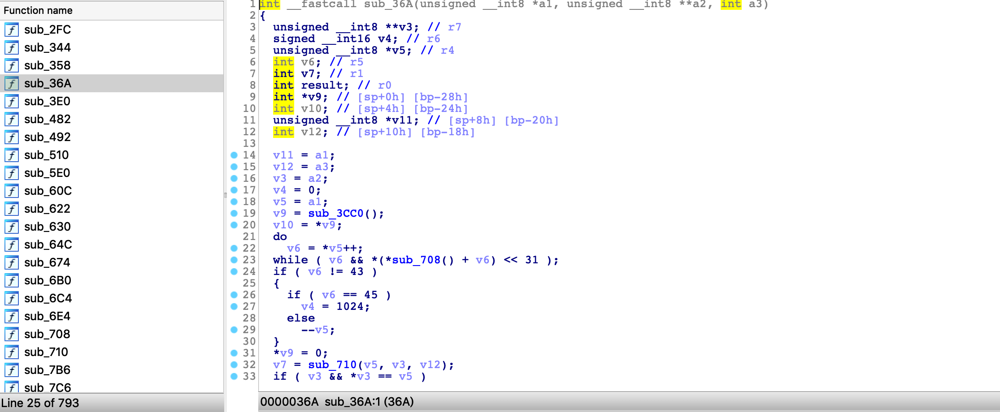
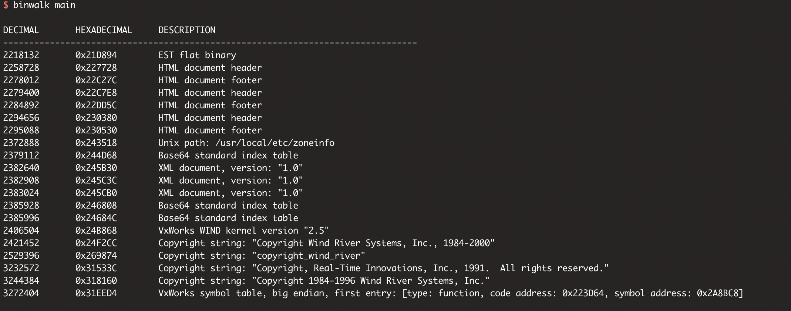

[TOC]

## 概述
针对于固件操作系统类型的不同，可以将物联网设备的固件进行如下的分类。

## 固件分类

根据固件操作系统类型的不同，可以大概分为下面三类：

1. **通用型操作系统**。在嵌入式的设备固件中，一般都是**使用的 linux 内核、unix 风格文件系统**的操作系统，libc 库使用的是 glibc。 而 IOT 设备中常见的函数库为精简版本的 libc，即 uClibc。具有的代表性的设备有智能路由器、智能摄像头固件等。

2. **实时操作系统**。例如 VxWorks 和 FreeRTOS 等为常见的实时操作系统。许多路由器厂商也会使用 VxWorks 作为其固件文件系统，如 TPLINK 路由器固件。

3. **无操作系统/裸机**。这类的设备可以看作是 "单片机设备"，设备固件中是比较简单的控制、循环逻辑，利用中断、例程来处理外部世界的各种事件，如常见的智能门锁内部固件。

- 如下图中为某个门锁的固件，固件中的汇编代码中不存在函数的符号表、got 表等信息，直接静态逆向分析的难度大。在后面会单独介绍关于此类固件的逆向方法和逆向技巧。

## 不同类型固件的设备特点

1. 通用型操作系统的特点是适合于处理大量的数据、高计算量的设备。固件一般存在完整的符号表，逆向难度较小。
2. 无操作系统/裸机的设备的能耗低，资源管理高效，适合长时间续航。固件代码都是静态编译，对于库函数也没有相应的符号名称。

- 后两种操作系统可以统称为轻量级物联网设备。

## 通用型操作系统固件

对通用型操作系统固件进行 binwalk 解包之后，通常就是熟悉的 unix 风格的目录结构，如下。分析时，对相应的 cgi 程序、脚本代码使用 IDA、 Ghidra 等工具进行逆向即可。

## 实时操作系统固件

常见的实时操作系统固件的类型还可以分为：

1. VxWorks
2. FreeRTOS
3. eCos
4. ...

这里以 Vxworks 为例，使用 binwalk 进行固件的解析时，一般会有一些特征信息，如 `VxWorks WIND kernel version "2.5"` 等：

## 参考文献

[轻量级物联网设备固件内存漏洞挖掘研究](https://kns.cnki.net/KCMS/detail/detail.aspx?dbcode=CMFD&dbname=CMFD202001&filename=1020004498.nh&v=MjExNTMzcVRyV00xRnJDVVI3cWZaT1Z2Rnl2blY3dkxWRjI1SHJPNEd0WEZwNUViUElSOGVYMUx1eFlTN0RoMVQ= "轻量级物联网设备固件内存漏洞挖掘研究")

