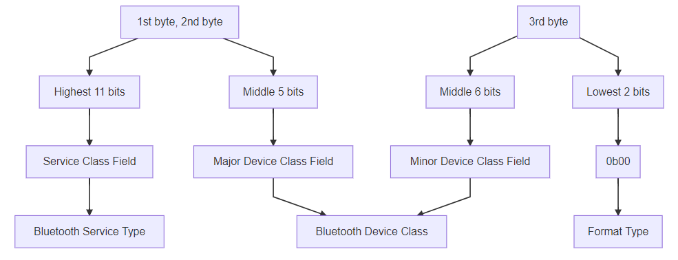

> Sourcell@海特实验室

Class of device，简称 CoD，用于描述一个 BR/EDR 设备的类型。

本地设备发起 inquiry (`HCI_Inquiry` command) 后，远端处于 inquiry scan 状态的设备会响应一些基本数据。这些数据被 controller 封装在 event 中返回给 host。CoD 则是这些 event 中的一个参数。此时包含可能 CoD 的 event 如下：

* `HCI_Inquiry_Result` event
* `HCI_Inquiry_Result_with_RSSI` event
* `HCI_Extended_Inquiry_Result` event

另外当本地设备收到远端设备的连接请求时，将收到 `HCI_Connection_Request` event。该 event 也会携带 CoD。

## 解析 CoD 结构

CoD 的格式是可变的，具体的格式由 Format Type 字段指定。其中最常见的格式是 "format #1"，且其他格式极其罕见。此时 CoD 是一个大小为 3 bytes 的数值，它的结构如下图所示（1st byte 为最高字节）：




下面将分别解释组成 CoD 的 3 个主要字段 Service Class, Major Device Class 与 Minor Device Class。

### Service Class

> 下面为 0 的位被保留使用

|      Flag       |        Description        | Example                                    |
| :-------------: | :-----------------------: | :----------------------------------------- |
| `1... .... 00.` |        Information        | WEB-server, WAP-server                     |
| `.1.. .... 00.` |         Telephony         | Cordless telephony, Modem, Headset service |
| `..1. .... 00.` |           Audio           | Speaker, Microphone, Headset service       |
| `...1 .... 00.` |      Object Transfer      | v-Inbox, v-Folder                          |
| `.... 1... 00.` |         Capturing         | Scanner, Microphone                        |
| `.... .1.. 00.` |         Rendering         | Printing, Speaker                          |
| `.... ..1. 00.` |        Networking         | LAN, Ad hoc                                |
| `.... ...1 00.` |        Positioning        | Location identification                    |
| `.... .... 001` | Limited Discoverable Mode |                                            |

### Major Device Class

|  Value  |        Description        | Example                                      |
| :-----: | :-----------------------: | :------------------------------------------- |
| 0b00000 |       Miscellaneous       |                                              |
| 0b00001 |         Computer          | Desktop, Notebook, PDA, Organizers           |
| 0b00010 |           Phone           | Cellular, Cordless, Payphone, Modem          |
| 0b00011 | LAN /Network Access point |                                              |
| 0b00100 |        Audio/Video        | Headset, Speaker, Stereo, Video display, VCR |
| 0b00101 |     Peripheral (HID)      | Mouse, Joystick, Keyboards                   |
| 0b00110 |          Imaging          | Printing, Scanner, Camera, Display           |
| 0b00111 |         Wearable          |                                              |
| 0b01000 |            Toy            |                                              |
| 0b01001 |          Health           |                                              |
| 0b11111 |       Uncategorized       |                                              |
| Others  |         Reserved          |                                              |

### Minor Device Class

该字段虽然仅占用 8 bits，但是当 major device class 不同时，每个 bit 的含义也不同。因此该字段的定义很繁杂，不在这里赘述。具体可以参考 ref [1]。

### 一个解析 CoD 的例子

当 CoD 为 `0x002540` 时有：

```txt
0... .... .... .... .... .... = Service Classes: Information: False
.0.. .... .... .... .... .... = Service Classes: Telephony: False
..0. .... .... .... .... .... = Service Classes: Audio: False
...0 .... .... .... .... .... = Service Classes: Object Transfer: False
.... 0... .... .... .... .... = Service Classes: Capturing: False
.... .0.. .... .... .... .... = Service Classes: Rendering: False
.... ..0. .... .... .... .... = Service Classes: Networking: False
.... ...0 .... .... .... .... = Service Classes: Positioning: False
.... .... 00.. .... .... .... = Service Classes: Reserved: 0x0
.... .... ..1. .... .... .... = Service Classes: Limited Discoverable Mode: True
.... .... ...0 0101 .... .... = Major Device Class: Peripheral (HID) (0x05)
.... .... .... .... 01.. .... = Minor Device Class: Keyboard (0x1)
.... .... .... .... ..00 00.. = Minor Device Class: Uncategorized device (0x0)
.... .... .... .... .... ..00 = Format Type: 0x0
```

## CoD 的伪装

CoD 并不是写死在 controller 中的数据，实际上它被 host 管理。Host 可以使用 `HCI_Write_Class_of_Device` command 修改本地设备的类型，从而达到伪装的目的。使用如下命令可以读取或修改本地 BR/EDR 设备的类型：

```sh
hciconfig hci0 class
# hci0:   Type: Primary  Bus: USB
#         BD Address: 11:22:33:44:55:19  ACL MTU: 310:10  SCO MTU: 64:8
#         Class: 0x0c0000
#         Service Classes: Rendering, Capturing
#         Device Class: Miscellaneous,

sudo hciconfig hci0 class 0x002540
hciconfig hci0 class
# hci0:   Type: Primary  Bus: USB
#         BD Address: 11:22:33:44:55:19  ACL MTU: 310:10  SCO MTU: 64:8
#         Class: 0x002540
#         Service Classes: Unspecified
#         Device Class: Peripheral, Keyboard
```

另外 ref [2] 是一个在线的 CoD 生成器，可以帮助我们根据选定的设备类型自动生成 CoD 数值。

## References

1. [Assigned Numbers for Baseband](https://www.bluetooth.com/specifications/assigned-numbers/baseband/)
2. [Bluetooth Class of Device/Service (CoD) Generator](http://bluetooth-pentest.narod.ru/software/bluetooth_class_of_device-service_generator.html)
3. BLUETOOTH CORE SPECIFICATION Version 5.1 | Vol 3, Part C page 2107, 3.2.4 Class of device

